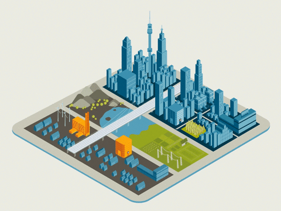
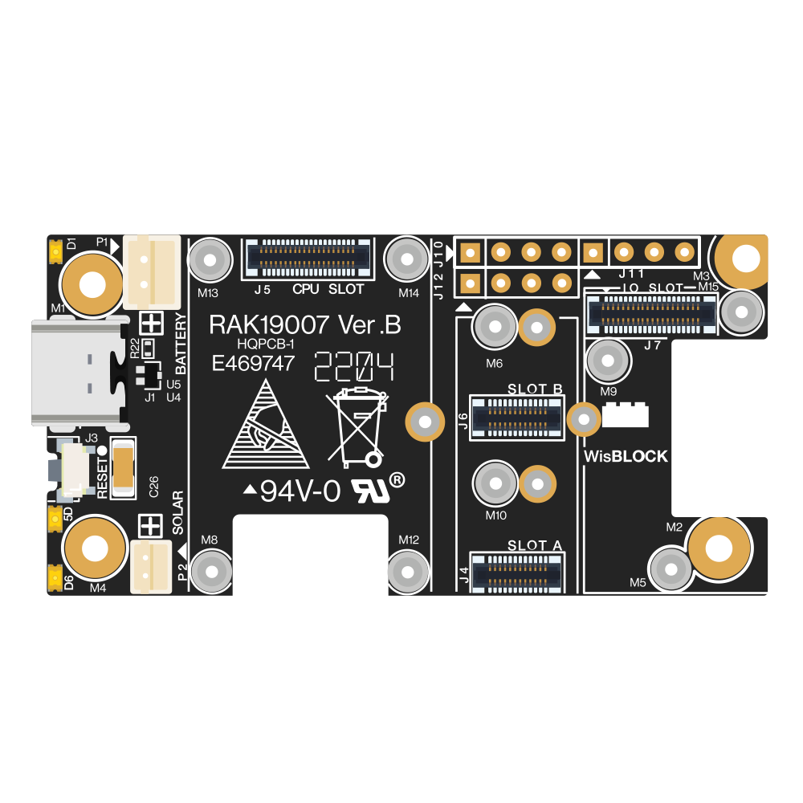
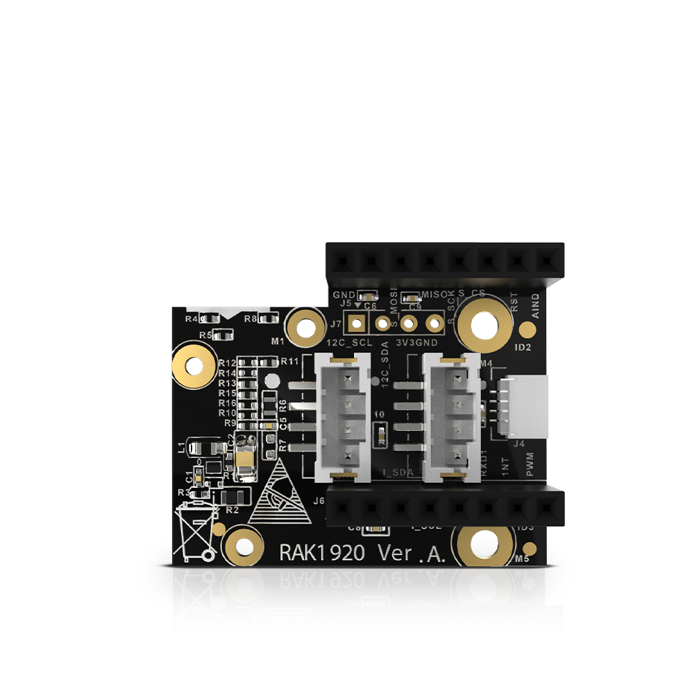

# GreenCity

## Projektidee und Motivation
Eine Smart City ist eine vernetzte Stadt, die oft als Lösung für verschiedene Herausforderungen des städtischen Lebens betrachtet wird. sie sind ausserdem Nachhaltig und wirken positive auf die Wirtschaft.

Allgemein werden Smart Cities entwickelt um Effizienzsteigerung durch den Einsatz intelligenter Technologien und Datenanalyse zu erreichen. ausserdem steht Ressourcenmanagement im Vordergrund da Smart Cities darauf abzielen, den Ressourcenverbrauch zu optimieren und nachhaltige Lösungen zu fördern. Das ganze führt dazu die Lebensqualität der Bürger zu verbessern. Zum Beispiel können Sensoren in der Stadt Luftqualität und Lärmbelastung überwachen, um die Umweltbedingungen zu verbessern.

Durch den Klimawandel wird es in deutschen Städten immer heißer. Grünflächen und Stadtbäume senken die Temperaturen messbar, doch durch die extremen Sommer sind sie von Trockenheit Bedrohnt. Mit dem Projekt GreenCity soll die Wasserversorgung der Stadtbäume aufgezeichnet werden, damit bei austrocknungsgefahr gezielt  bewässert werden kann. Dadurch kann Personal und Wasser eingespart werden.

## Aufbau
Auf der Physikalischenebene wird ein Arduino verwendet, der die Bodenfeuchtigkeit misst und sie über das Lorawan im The Things Network(TTN) versendet. Im TTN werden die Empfangenen Daten decodiert und weiter an den MQTT-Broker Übergeben. Die Influx Daten Bank abonniert die entsprechenden Sensoren und speichert die Daten, über Grafana werden sie dann Dargestellt.

## Hardware 

### Arduino 
Als Basis wird das Modular System von WisBlock "RAK Wireless" verwendet.

LPWAN Module:     RAK4631 WisBlock 

Basis Bord:       RAK19007 WisBlock 

Adapter Module:   RAK1920 WisBlock  

### Sensor 
Zur Bodenfeuchtigkeitsmessung wird der Bodenfeuchtesensor Hygrometer Modul V2.0 kapazitiv verwendet. Dieser Sensor gibt eine elektronische spannung zurück, diese Spanung haben wir durch Probemessungen mit trocken boden bis überflutten boden auf zwei zahlen für max und min Festgelegt.

#### Anschluss

## Software 

### Entwicklungsumgebung
Als Entwicklungsumgebung wurde Visual Studio Code verwendet. Zusätzlich wird das PlatformIO PlugIn benötigt, in welchem die NRF52 Plattform installiert und die RAK4631 Cores hinzugefügt werden mussten. 

### Programmteile
Die platformio.ini ist die Konfigurationsdatei des Projekts. 
Die main Dateien sind der Kern des Projekts. In diesen wird alles gestartet und verwaltet.  
Die main.cpp kümmert sich um das setup, die Initialisierung und startet die Prozess-Schleife. Die main.h Datei ist für das Definieren aller benötigten Pins und Timeout-Zeiten da und included die benötigten Packages.  
Die lorawan.cpp ist, wie der Name schon sagt, für die LoraWan Kommunikation zuständig und sendet die Daten des Sensors und kümmert sich um Errors.  

### Verwendete Packages
Als Packages nutzen wir die Arduino und Adafruit_TinyUSB Libraries, das SPI und Wire Interface und die SX126x-Arduino und LoRaWan-RAK4630 API. 

## Sendeinterwall 
Das Sendeinterwall ist auf einmal pro Minute aus Vorführungsgründen eingestellt. Jedoch würde im Realbetrieb eine Naricht pro Stunde genügen.

## The Things Network 

### Payload
int-Wert mit Größe 1 Byte, welcher mit Werten von 0-100 (in hex) die prozentuale Bodenfeuchte übergibt. 0(%) ist trocken und 100(%) ist nass. 

##  Mqtt

## Influx DB 

## Grafana 

### Daten auswertung 
Die Messdaten sind keine absoluten Werte, sondern abhängig von der Boden zusammensetzung. Zusetzlich ist zubeachten, dass die Ausagekraft über die hinreichende Versorgung eine Pflanze mit Wasser abhängig 
von der Durchwurzelungstiefe. Wir Empfelen deshalb diesen spezifischen Aufbau nur für Pflanzen mit einer maximalen Wurzeltiefe von 20 cm.

## Quellen
https://www.nccs.admin.ch/nccs/de/home/sektoren/wasserwirtschaft/auswirkungen-auf-den-wasserhaushalt/bodenfeuchteundverdunstung.html
https://www.dwd.de/DE/klimaumwelt/ku_beratung/landwirtschaft/agrar_modelle/ambav.pdf?__blob=publicationFile&v=2  
https://github.com/RAKWireless/WisBlock/tree/master/examples  
https://www.thethingsindustries.com/docs/integrations/payload-formatters/javascript/uplink/  
https://test-wetterstation.de/arduino-moisture-sensor  

